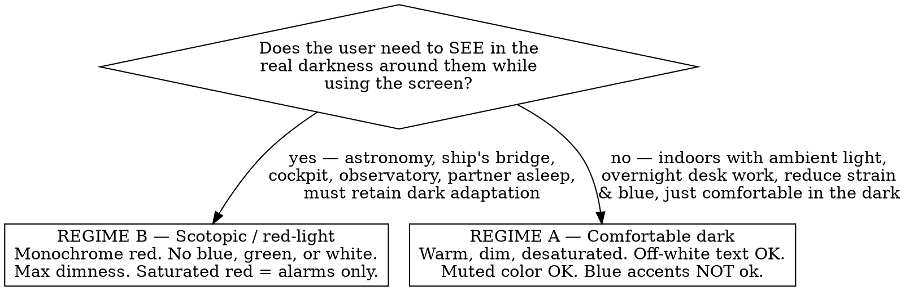

# Designing for Night Vision

## Overview

A dark theme is not a night-vision theme. A "dark mode" optimized for looking sleek (cool grey backgrounds, soft-white text, a bright blue accent) is close to the *worst* thing to put in front of dark-adapted eyes.

**Core principle: luminance is the master lever, not hue.** Dark adaptation takes 20–30 minutes to build and a single bright frame to destroy. Design to emit as little light as the task allows, then shift what remains away from the wavelengths the eye is most sensitive to at night.

The vision science you must respect:
- **Rods** (night vision) peak around **500 nm — blue-green** — and are nearly blind to deep red (>620 nm). So **red/amber light lets cones read the screen while rods stay dark-adapted.** This is why bridges, cockpits, submarines and observatories go red.
- **Melanopsin/ipRGCs** (circadian, melatonin, pupil) peak around **480 nm — blue.** Blue light at night is doubly bad: it suppresses melatonin *and* it is exactly what rods detect.
- **Purkinje shift:** in dim light the eye's peak sensitivity slides toward blue, so blues read disproportionately glary and reds read nearly black. A blue that looks tame in daylight flares at night.
- **Halation/bloom:** bright elements on a dark field bloom (worse with astigmatism and thin strokes). Pure white text and large bright fills are the main offenders.

## Choose the regime FIRST

The single biggest mistake is building the wrong *kind* of night UI. Decide before picking any color:

| | **A — Comfortable dark** | **B — Scotopic / red-light** |
|---|---|---|
| Goal | Reduce glare, blue light, melatonin suppression, eye strain | Preserve rod-based dark adaptation |
| Background | Warm/neutral near-black | Warm near-black, faint red tint |
| Text | Warm off-white (capped, never `#FFF`) | Desaturated red/amber only |
| Color | Muted/desaturated allowed (incl. dim green/amber) | Red family only — no blue, no green, no white |
| Brightness | Dim | As dim as legibility allows |
| Saturated color | Sparingly, for alerts | Alarms ONLY |

Copy-paste token sets for both regimes are in **palettes.css** (in this skill directory). Pick one regime's block; don't blend them. If an app needs both, ship Regime A as the default night theme and Regime B as a separate "red light" toggle layered on top.

## Non-negotiable rules (both regimes)

- **Never pure black (`#000`) or pure white (`#FFF`).** Near-black avoids OLED smear and gives depth; off-white/red text avoids halation.
- **Luminance is capped, not maximized.** Build hierarchy by *darkening backgrounds*, not brightening foregrounds. Cap the brightest pixel on screen.
- **No bright flashes — ever.** No white modals, toasts, image thumbnails, spinners, skeleton shimmers, or camera feeds appearing un-gated. One white frame undoes 20–30 minutes of adaptation. Gate any unavoidable bright content behind an explicit "ready?" confirm.
- **Heavier, larger, looser type.** Light-on-dark blooms and thin weights vanish — use weight **500+**, larger sizes, slightly increased line-height, `tabular-nums` for changing numbers.
- **Interaction states change by darkening or saturating, never a luminance spike.** Hover = slightly more saturated; active = darker. Critical alerts dim-pulse, they don't flash.
- **Give the user a brightness control** (scale `filter: brightness()` on the root) so they tune to ambient conditions — screens rarely go dim enough at the OS level.
- **Don't encode status by color alone** — pair with icon/shape (accessibility, and night palettes compress the usable hue range).

## Reconciling with WCAG contrast

You still need legibility, but capping luminance fights naive contrast math, and a correct red-on-near-black readout can fail a WCAG ratio computed against white assumptions. Resolve it honestly:
- Keep **text large and heavy** so it stays legible at lower contrast (WCAG itself relaxes ratios for large/bold text: 3:1 vs 4.5:1).
- Aim for solid contrast on key data, but **achieve it by darkening the background**, not by pushing the foreground brighter than the regime's cap.
- Document the deviation: a deliberately dim red readout is a domain requirement, not an oversight. Provide the brightness control and (Regime A) a normal daytime theme via `prefers-color-scheme` so non-dark users aren't forced into it.

## Common mistakes

| Mistake | Why it's wrong | Fix |
|---|---|---|
| Cool blue-grey background + **blue accent** (generic "dark mode") | Blue (~480 nm) is the worst wavelength — bleaches rods *and* suppresses melatonin | Warm near-black bg; amber/red accent and focus ring |
| Soft-white text on near-black | Halation/bloom; still emits blue-green | Warm off-white (A) or desaturated red (B); cap the bright end |
| Pure `#000` background | OLED smear/black-crush; makes bright elements pop harder | Near-black (`#0B0605`–`#121013`) |
| Green "OK" / bright status dots | Green sits near rods' peak; glares at night | Dim amber for nominal; reserve saturated color for alarms |
| Thin/light font weights | Vanish and shimmer at low luminance | 500+ weight, larger size |
| Bright toast/modal/spinner flashes in | Destroys adaptation in one frame | Dim, in-palette; gate any bright content |
| "I'll just dim a white screen" | A dimmed white screen still emits full-spectrum blue-green | Restrict the *spectrum* (warm/red), then dim |

## Verify it

View the build at **minimum screen brightness in a fully dark room**. Nothing should glow, bloom, or draw the eye except a real alert. If a white edge, blue ring, or bright panel jumps out, it's wrong — darken or re-hue it, don't ship it.
